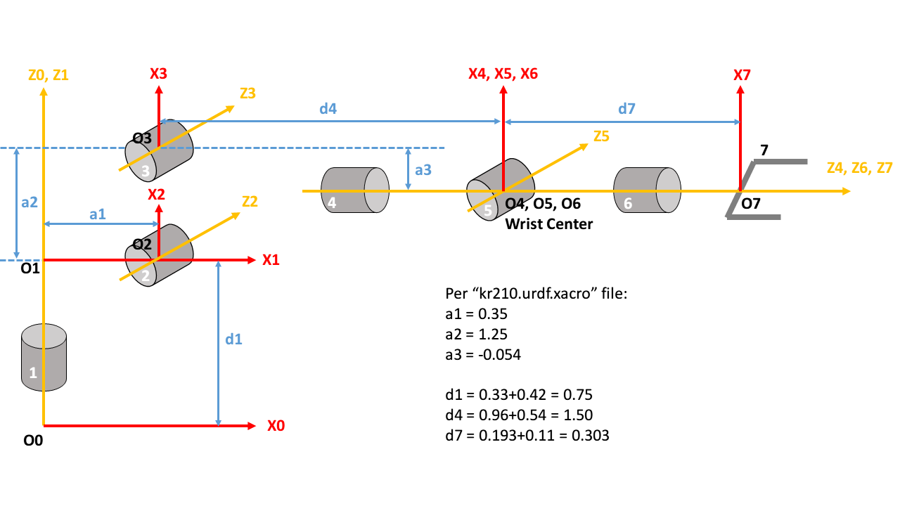

## Project: Kinematics Pick & Place

### I. Forward Kinematics

#### 1. Coordinate frame definitions

Note the origin and orientation of the frames for DH parameters are different than that defined in kr210.urdf.xacro file.




#### 2. DH parameter table
```
    {alpha0:     0, a0:      0, d1: 0.750,
     alpha1: -pi/2, a1:  0.350, d2:     0, q2: q2-pi/2,
     alpha2:     0, a2:  1.250, d3:     0,
     alpha3: -pi/2, a3: -0.054, d4: 1.500,
     alpha4:  pi/2, a4:      0, d5:     0,
     alpha5: -pi/2, a5:      0, d6:     0,
     alpha6:     0, a6:      0, d7: 0.303, q7: 0}
```
where `a1, a2, a3, d1, d4, d7` are extracted from the kr210.urdf.xacro file.

#### 3. Homogenous transforms

Define:
```
T_(i-1)_i = 
    [[                 cos(theta_i),                 -sin(theta_i),               0,                   a_i-1], 
     [sin(theta_i) * cos(alpha_i-1), cos(theta_i) * cos(alpha_i-1), -sin(alpha_i-1), -sin(alpha_i-1) * d_i-1], 
     [sin(theta_i) * sin(alpha_i-1), cos(theta_i) * sin(alpha_i-1),  cos(alpha_i-1),  cos(alpha_i-1) * d_i-1], 
     [                            0,                             0,                0,                      1]]
```
then
```
T_0_7 = T0_1 * T1_2 * T2_3 * T3_4 * T4_5 * T5_6 * T6_EE
```
where `7` = end effector.

On the other hand, if define gripper links final orientation as a series rotation of roll, pitch and yaw, the rotation matrices are:
```
R_X = Matrix([[          1,           0,          0],
              [          0,   cos(roll), -sin(roll)],
              [          0,   sin(roll), cos(roll)]])
              
R_Y = Matrix([[ cos(pitch),           0, sin(pitch)],
              [          0,           1,          0],
              [-sin(pitch),           0, cos(pitch)]])

R_Z = Matrix([[   cos(yaw),   -sin(yaw),          0],
              [   sin(yaw),    cos(yaw),          0],
              [          0,           0,          1]])
              
R0_7 = R_Z * R_Y * R_X
```
where `7` = end effector.

In both cases, due to frame not aligned between frames used in DH and URDF, the correction rotation matrix is:
```
R_correction = R_Z(yaw=pi) * R_Y(pitch=-pi/2)
```

Then
```
T_0_7_corrected = T_0_7 * R_correction
R0_7_corrected  =  R0_7 * R_correction
```

### II. Inverse  Kinematics

#### 1. Wrist center

Knowing final coordinates of gripper is:
```
r_ee_0 = Matrix([[px],
                 [py],
                 [pz]])
```

and the vector between wrist center and gripper is:
```
r_ee_wc = 0.303 * R0_7_corrected*Matrix([[0],
                                         [0],
                                         [1]])
```
From `r_ee_0 = r_wc_0 + r_ee_wc`, we can calculate `r_wc_0 = r_ee_0 - r_ee_wc`.

#### 2. Other joints


With the help of the figure above, other joint angles are derived below.

```
theta1 = atan2(r_wc_0[1], r_wc_0[0])
side_b = sqrt(pow(sqrt(r_wc_0[0] * r_wc_0[0] + r_wc_0[1] * r_wc_0[1]) - 0.35, 2) +
              pow(r_wc_0[2] - 0.75, 2))

angle_a = acos((side_b * side_b + SIDE_C * SIDE_C - SIDE_A * SIDE_A) / (2 * side_b * SIDE_C))
angle_b = acos((SIDE_A * SIDE_A + SIDE_C * SIDE_C - side_b * side_b) / (2 * SIDE_A * SIDE_C))

theta2 = pi / 2. - angle_a - atan2(r_wc_0[2] - 0.75,
                                   sqrt(r_wc_0[0] * r_wc_0[0] + r_wc_0[1] * r_wc_0[1]) - 0.35)

theta3 = pi / 2. - (angle_b + 0.036)

R0_3 = _fks.T0_3[0:3, 0:3]
R0_3 = R0_3.evalf(subs={_fks.q1: theta1,
                        _fks.q2: theta2,
                        _fks.q3: theta3})
R3_6 = R0_3.inv("LU") * R0_7_corrected

theta4 = atan2(R3_6[2, 2], -R3_6[0, 2])
theta5 = atan2(sqrt(R3_6[0, 2] * R3_6[0, 2] + R3_6[2, 2] * R3_6[2, 2]), R3_6[1, 2])
theta6 = atan2(-R3_6[1, 1], R3_6[1, 0])
```
